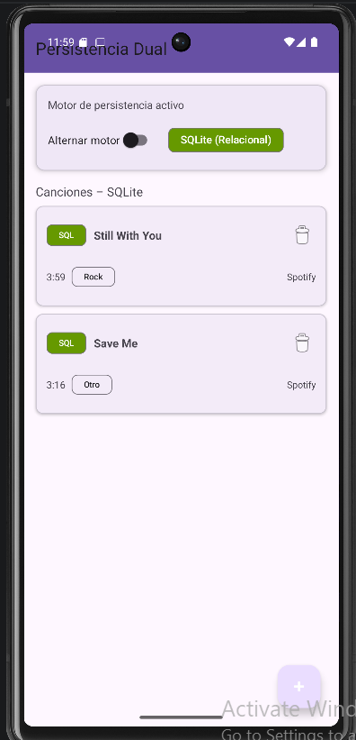
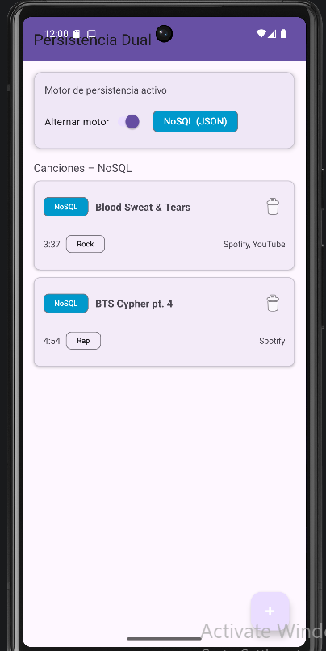

# 🎵 Persistencia Dual — Canciones Favoritas

> Aplicación Android nativa en Kotlin que implementa una arquitectura híbrida de almacenamiento local,
> permitiendo conmutar en tiempo de ejecución entre un motor relacional (SQLite) y un motor no relacional
> (JSON) sin alterar la interfaz de usuario.

---

## Capturas de pantalla

| Modo SQLite (Relacional) | Modo NoSQL (JSON) |
|:---:|:---:|
|  |  |

---

## Descripción

**Persistencia Dual** es un CRUD de canciones favoritas cuya característica central es la capacidad de cambiar el motor de almacenamiento en caliente, sin reiniciar la aplicación. El usuario puede registrar canciones con nombre, duración, categoría musical y uno o varios enlaces externos (Spotify, YouTube, SoundCloud, Apple Music u Otro). Al alternar el switch en la pantalla principal, la lista se actualiza instantáneamente leyendo desde el almacén activo — los datos de SQLite y los datos JSON son completamente independientes entre sí.

---

## Arquitectura

El proyecto sigue una arquitectura de **4 capas** estrictamente separadas, donde ninguna capa conoce los detalles de implementación de la capa inferior:

```
┌─────────────────────────────────────────────┐
│              CAPA UI (Fragments)            │
│   SongListFragment  ·  SongFormFragment     │
│   No importa ningún repositorio concreto    │
└──────────────────────┬──────────────────────┘
                       │ observa StateFlow
┌──────────────────────▼──────────────────────┐
│           CAPA VIEWMODEL                    │
│              SongViewModel                  │
│  StateFlow<List<Song>>  ·  switchEngine()   │
│  Dispatchers.IO para todas las operaciones  │
└──────────────────────┬──────────────────────┘
                       │ habla solo con la interfaz
┌──────────────────────▼──────────────────────┐
│         CAPA REPOSITORIO (interface)        │
│            SongRepository                  │
│    getAll() · insert() · update() · delete()│
│         ┌──────────┴──────────┐            │
│  SqliteSongRepository   JsonSongRepository  │
└──────────┬──────────────────────┬──────────┘
           │                      │
    ┌──────▼──────┐      ┌────────▼───────┐
    │  songs.db   │      │songs_nosql.json│
    │ songs table │      │docs embebidos  │
    │ song_links  │      │(links en doc)  │
    └─────────────┘      └────────────────┘
          Almacenes completamente independientes
```

### Decisiones de diseño clave

**Patrón Repositorio:** `SongListFragment` y `SongFormFragment` únicamente importan `SongViewModel`. Ninguna vista conoce la existencia de `SqliteSongRepository`, `JsonSongRepository` ni `SongDbHelper`. El `SongViewModel` trabaja exclusivamente contra la interfaz `SongRepository`, y al cambiar de motor simplemente sustituye la referencia activa por la otra implementación.

**Conmutación reactiva:** `switchEngine(useSql: Boolean)` en el ViewModel intercambia el repositorio activo, llama a `getAll()` en el nuevo motor y emite el resultado en un `MutableStateFlow`. Los fragments observan ese flow con `repeatOnLifecycle(STARTED)`, por lo que la lista se actualiza automáticamente en el hilo principal sin ninguna intervención adicional.

**Diferencia filosófica entre motores:**
- En **SQLite** los links de una canción se almacenan en una tabla separada `song_links` con clave foránea `ON DELETE CASCADE`, lo que demuestra el modelo relacional normalizado.
- En **JSON** cada documento incluye los links embebidos dentro del mismo objeto, sin joins ni integridad referencial — modelo de documento desnormalizado.

---

## Stack tecnológico

| Componente | Tecnología |
|---|---|
| Lenguaje | Kotlin (Android nativo) |
| UI | XML Views · ViewBinding · Material Components 1.12 |
| Almacén relacional | `SQLiteOpenHelper` · API nativa de Android |
| Almacén no relacional | Gson 2.11 · archivo `songs_nosql.json` en `filesDir` |
| Estado | `StateFlow` · `viewModelScope` · `Dispatchers.IO` |
| Navegación | `FragmentManager` · `beginTransaction()` · back stack |
| Tests | JUnit 4 · Coroutines Test 1.9 · `androidx.test` |

---

## Estructura del proyecto

```
app/src/main/java/com/example/persistenciadual/
│
├── model/
│   ├── Song.kt              # Entidad de dominio: id, title, duration, category, links
│   ├── SongLink.kt          # Enlace externo: platform, url
│   └── Category.kt          # Enum: ROCK, POP, ELECTRONICA, RAP, JAZZ, CLASICA, OTRO
│
├── repository/
│   ├── SongRepository.kt         # Interfaz: getAll / insert / update / delete
│   ├── SqliteSongRepository.kt   # Implementación SQL con transacciones y FK CASCADE
│   └── JsonSongRepository.kt     # Implementación NoSQL con Gson y filesDir
│
├── db/
│   └── SongDbHelper.kt      # SQLiteOpenHelper: CREATE TABLE songs + song_links
│
├── ui/
│   ├── SongViewModel.kt     # AndroidViewModel: StateFlow, switchEngine, CRUD en IO
│   ├── SongListFragment.kt  # Pantalla principal: switch, chip, RecyclerView, FAB
│   └── SongFormFragment.kt  # Formulario crear/editar con links dinámicos
│
├── adapter/
│   └── SongAdapter.kt       # ListAdapter con DiffUtil
│
└── MainActivity.kt

app/src/main/res/layout/
├── activity_main.xml         # FrameLayout contenedor
├── fragment_song_list.xml    # CoordinatorLayout con switch, chip, RecyclerView y FAB
├── fragment_song_form.xml    # Formulario con TextInputLayout, Spinner y links
├── item_song.xml             # Card de canción con chips de motor y categoría
└── item_link_row.xml         # Fila dinámica: Spinner plataforma + URL + botón quitar

app/src/test/
└── JsonSongRepositoryTest.kt      # 3 pruebas locales JVM (insert, delete, update)

app/src/androidTest/
└── SqliteSongRepositoryTest.kt    # 2 pruebas instrumentadas (insert + cascade delete)
```

---

## Modelo de datos

### SQLite — esquema relacional

```sql
CREATE TABLE songs (
    id         INTEGER PRIMARY KEY AUTOINCREMENT,
    title      TEXT    NOT NULL,
    duration   TEXT    NOT NULL,
    category   TEXT    NOT NULL,
    created_at INTEGER NOT NULL
);

CREATE TABLE song_links (
    id       INTEGER PRIMARY KEY AUTOINCREMENT,
    song_id  INTEGER NOT NULL,
    platform TEXT    NOT NULL,
    url      TEXT    NOT NULL,
    FOREIGN KEY (song_id) REFERENCES songs(id) ON DELETE CASCADE
);
```

### JSON — modelo de documento

```json
[
  {
    "id": 1,
    "title": "Blood Sweat & Tears",
    "duration": "3:37",
    "category": "ROCK",
    "links": [
      { "platform": "Spotify", "url": "https://open.spotify.com/track/..." },
      { "platform": "YouTube", "url": "https://youtube.com/watch?v=..." }
    ]
  }
]
```

Archivo persistido en: `context.filesDir/songs_nosql.json`

---

## Cómo ejecutar

### Requisitos
- Android Studio
- Android SDK API 36 (Baklava)
- Emulador o dispositivo con Android 8.0+ (minSdk 26)

### Correr la aplicación
```bash
# Desde Android Studio
Run → Run 'app'   (Shift + F10)
```

### Correr los tests locales (sin emulador)
```bash
./gradlew test
# o en Android Studio: clic derecho sobre JsonSongRepositoryTest → Run
```

### Correr los tests instrumentados (requiere emulador activo)
```bash
./gradlew connectedAndroidTest
# o en Android Studio: clic derecho sobre SqliteSongRepositoryTest → Run
```

---

## Flujo de demostración

La independencia de los motores se puede verificar en vivo con estos pasos:

1. **Motor en SQLite (switch apagado):** crear las canciones "Hotel California" y "Bohemian Rhapsody" con sus links. Confirmar que aparecen en la lista con el chip verde "SQL".

2. **Cambiar a NoSQL (switch encendido):** la lista queda vacía de inmediato — los datos de SQLite no existen en el almacén JSON. Crear "Blood Sweat & Tears" con links de Spotify y YouTube.

3. **Volver a SQLite (switch apagado):** "Hotel California" y "Bohemian Rhapsody" reaparecen. "Blood Sweat & Tears" no existe en este motor.

4. **Inspección de archivos:** en el Device File Explorer de Android Studio se pueden abrir directamente:
   - `data/data/com.example.persistenciadual/databases/songs.db` — filas en tablas relacionadas
   - `data/data/com.example.persistenciadual/files/songs_nosql.json` — documentos con links embebidos

---

## Trazabilidad de logs

Todos los eventos de persistencia se registran en Logcat con tags por capa. Ejemplo:

```
D/JsonRepo:    DEBUG — Lectura songs_nosql.json → 2 documentos
I/JsonRepo:    INFO  — INSERT doc id=1 title="Blood Sweat & Tears" links=2
I/SongViewModel: INFO — Motor cambiado a: SQL
I/SqliteRepo:  INFO  — INSERT song id=1 title="Hotel California" links=1
I/SqliteRepo:  INFO  — DELETE song id=1 rows=1 (links eliminados por CASCADE)
E/JsonRepo:    ERROR — UPDATE doc id=99 no encontrado
```

---

## Dependencias principales

```toml
# gradle/libs.versions.toml
gson            = "2.11.0"
coroutines      = "1.9.0"
lifecycle       = "2.9.0"
```

```kotlin
// app/build.gradle.kts
implementation(libs.gson)
implementation(libs.kotlinx.coroutines.android)
implementation(libs.lifecycle.viewmodel.ktx)
implementation(libs.lifecycle.runtime.ktx)
testImplementation(libs.kotlinx.coroutines.test)
```

---